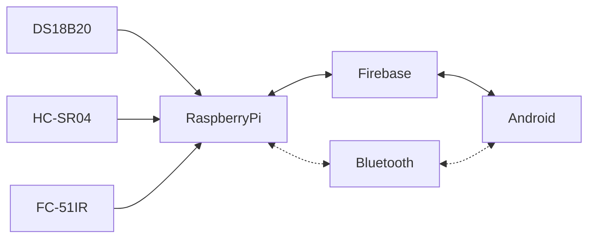

# Brief CENG Capstone Project Charter
-  [x] Select Project area:
1. [X] :bike: Facilities: e.g. Bicycle Rental/Parking Lot/Vision System
2. [ ] :factory: Building Automation: e.g. Greenhouse/SolarPanel/Home
3. [ ] :movie_camera: Consumer: e.g. Entertainment Protocol DMX/Baby Monitoring Project
4. [ ] :mortar_board: Education: e.g. Robust Hackable Educational Project
5. [ ] :robot: Robotics: e.g. Control/Navigation/Dashboard
6. [ ] :ski: Health and Wellness: e.g. Wearable
####  Project Title: 
TriSense: An Intelligent Waste Management System

####  Executive Summary/Description of the Project (75 to 100 words): 
The Trisense Smart Bin System employs three crucial sensors for efficient waste management: the Ultrasonic Distance Sensor (HC-SR04) gauges fill levels, the DS18B20 Temperature Sensor tracks temperature, and the FC-51 IR Proximity Sensor detects lid status. These sensors collaborate seamlessly, offering real-time data for enhanced waste collection efficiency. An Android app complements this system, allowing users to monitor bins and optimize collections via Firebase integration. This innovation promises to transform waste management, fostering environmental sustainability and economic efficiency.

####  Has this project been approved by all parties for posting (Y/N)?
-  [x] Yes
-  [ ] No

Optional Collaborator fields for sponsored projects

#### Sponsoring Industry and Personnel: 
#### Hours contributed: 
#### Number of full-time employees, year established, private or not-for-profit: 
#### Value of equipment or access to equipment provided: 
#### FAST contribution: 

####  List of Names of Students Involved in Project (first and last names and separate members by a comma):
Avindra Seepersaud (N01405195), Meet Patel (n01460090), Kyle Menegotti (n01462135)

####  Planned contact email for the [Expo submission form](https://appliedtechnology.humber.ca/shows/past-shows/advanced-manufacturing-projects/advanced-manufacturing-student-submission-form.html)
avindra.seepersaud@humber.ca

####  For each individual student state whether they have a complete parts kit, a multimeter, what development platform they have, what sensors/effectors they have along with system Requirements (List what sensors/effectors are to do), functionalty of prototype/describe any unsoldered connections.
Student One: Avindra Seepersaud 
- [X] Complete parts kit
- [X] Multimeter
- Development platform: Raspberry Pi 4 - Combines the official RPi Linux OS with Android OS to host an application, all interconnected through Firebase services. 
- Sensor/effector 1: HC–SR04 Ultrasonic Distance Sensor - This sensor measures the fill line by emitting sound waves and calculating the time it takes for the waves to bounce back, indicating the distance to the fill line.
- Unsoldered connection description: FC-51 IR Proximity Sensor and DS18B20 Tempature Sensor are not soldered on my hardware.

Student Two: Meet Patel
- [X] Complete parts kit
- [X] Multimeter
- Development platform: Raspberry Pi 4 - Combines the official RPi Linux OS with Android OS to host an application, all interconnected through Firebase services. 
- Sensor/effector 2: FC-51 IR Proximity Sensor - This sensor detects whether the bin is open or closed by emitting and receiving infrared light, triggering a signal change when the lid moves.
- Unsoldered connection description: HC–SR04 Ultrasonic Distance Sensor and DS18B20 Tempature Sensor are not soldered on my hardware.

Student Three: Kyle Menegotti
- [X] Complete parts kit
- [X] Multimeter
- Development platform: Raspberry Pi 4 - Combines the official RPi Linux OS with Android OS to host an application, all interconnected through Firebase services. 
- Sensor/effector 3: DS18B20 Temperature Sensor - This sensor measures temperature by utilizing a digital probe to accurately detect and relay temperature data within the bin, aiding in monitoring environmental conditions.
- Unsoldered connection description: HC–SR04 Ultrasonic Distance Sensor and FC-51 IR Proximity Sensor are not soldered on my hardware.

####  GitHub repository link(s):
https://github.com/AvindraSeepersaud5195/TriSenseAnIntelligentWasteManagementSystem

####  Google Play App download link:
https://play.google.com/store/apps/details?id=ca.innovators.united.it.trisense.an.intelligent.waste.management.system

#### Hours per student:
$14\*3=42$ in class hours, $14\*3=42+$ outside of class.

#### Supervising Faculty: 
Kris Medri   
Meirion Williams

####  Hours per faculty: 
$14\frac{3}{20}\*3=6.3$ in class, $14\frac{1.05+1.49}{20}\*3=5.334+$ outside of class.

####  Scope:
Creation of a Prototype that is not to be left powered unattended. Keeping safety and Z462 in mind, the highest AC voltage that is to be used is 16Vrms from a wall adapter from which +/- 15V or as high as 45 VDC can be obtained. Maximum power consumption is to be 20 Watts. In alignment with the space below the tray in the Humber North Campus Electronics Parts kit the overall project maximum dimensions are 12 13/16" x 5 ¹/₂" x 2 ³/₄" = 32.5cm x 14cm x 7cm. If your PCB doesn’t work or you need to switch sensors/effectors, it is recommended that you use the SparkFun Qwiic system: https://www.sparkfun.com/products/15945

####  Design approach:

####  Mandate: 
Self funded (unless a sponsor has contractually agreed to contribute).
- This project is completely self-funded.
